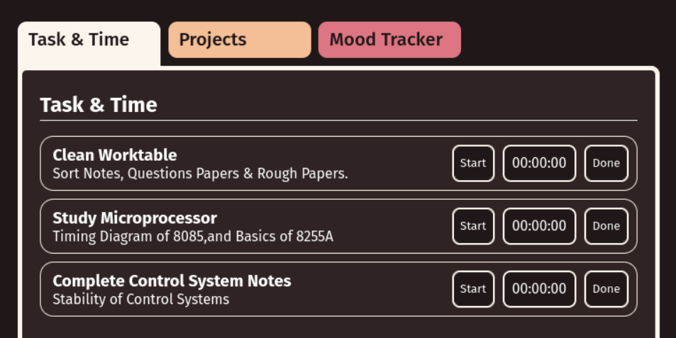

# zenflow



### Dependencies 

- Python3
- Django (pip-module)

### Local Setup Web Server

``` bash
git clone https://github.com/thekarananand/zenflow.git

cd ./zenflow

python3 manage.py makemigration
python3 manage.py migrate

```

### Run Web Server

``` bash
python3 manage.py runserver
```
